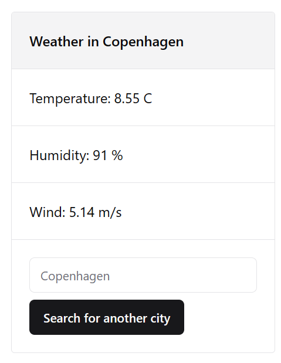
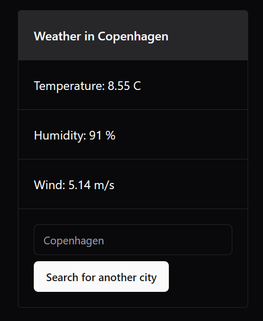
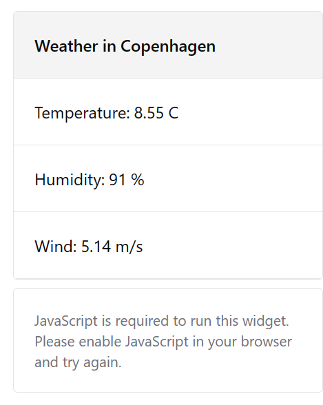

<h1 style="text-align:center">⛅</h1>

### Default



### Dark mode



### Not found


### No script



## How to run

Before running, add the follow env variable

```toml
# .env
OPEN_WEATHER_MAP_API_KEY=YOUR_KEY
```

```bash
# Test
pnpm test

# Dev
pnpm dev

# Build and run
pnpm build
pnpm start

# Dockerize
docker build -t weatherwidget .
docker run -p 3000:3000 weatherwidget
```
