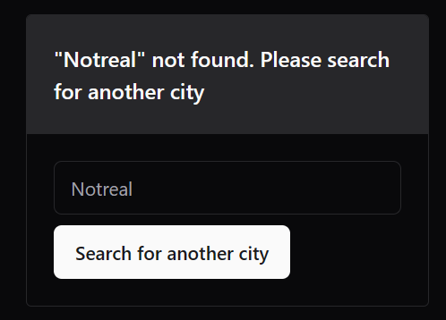

<h1 style="text-align:center">⛅</h1>

https://github.com/thebestclicker/weather-widget/assets/10188306/dc4adc96-07e6-496f-b219-fe2c7f2dbe08

### Default


### Dark mode


### Not found



### No script


## How to run

Before running, add the follow env variable

```toml
# .env
OPEN_WEATHER_MAP_API_KEY=YOUR_KEY
```

```bash
# Test
pnpm test

# Dev
pnpm dev

# Build and run
pnpm build
pnpm start

# Dockerize
docker build -t weatherwidget .
docker run -p 3000:3000 weatherwidget
```
